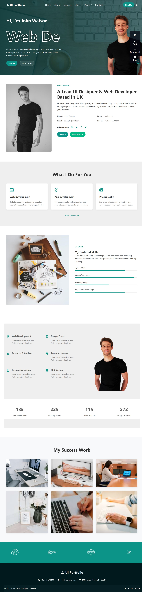

# UI Portfolio Website Project

A responsive portfolio website for a UI Designer/Web Developer named John Watson. This project was created as part of a web development assignment, focusing on recreating a provided design using HTML and CSS.

## Project Description

This website is a portfolio for a UI/UX designer named John Watson, featuring:

- Responsive navigation with dropdown menus
- Hero section with creative typography
- Biography/About section
- Skills and expertise showcase
- Services section
- Portfolio gallery
- Client logos
- Contact information and footer

## Technologies Used

- HTML5
- CSS3
- Font Awesome icons (via CDN)

## Project Structure

```
├── index.html
├── styles.css
├── images/
│   ├── johnt.png
│   ├── johnm.jpg
│   ├── background.webp
│   ├── skills.jpg
│   ├── work1.jpg
│   ├── work2.jpeg
│   └── ...
```

## Features

- Fully responsive design that works on mobile, tablet, and desktop
- Clean and semantic HTML structure
- Custom CSS styling without relying on frameworks
- Interactive elements (dropdown menus, hover effects)

## Screenshots


*Screenshot of the John Watson UI Portfolio website*

## Implementation Notes

The project was implemented by carefully analyzing the provided design and recreating it with HTML and CSS. Special attention was paid to:

- Creating a responsive layout using flexbox and grid
- Implementing dropdown navigation menus
- Creating smooth transitions and hover effects
- Ensuring proper spacing and typography
- Maintaining a clean, maintainable code structure

## Author

- Nombuso Simelane

## Acknowledgments

- Original design provided as part of the course assignment
- Font Awesome for the icon library